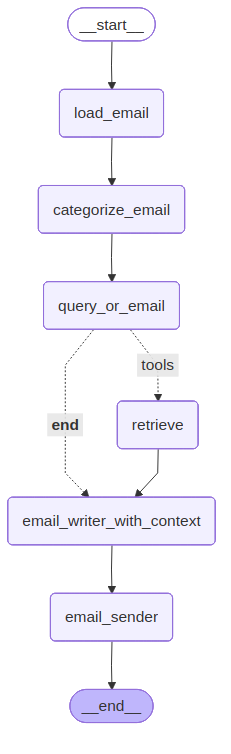

# 📧 LangGraph Gmail Support System

Un sistema inteligente de soporte por email construido con **LangGraph** que automatiza la gestión de consultas de clientes utilizando Gmail, RAG (Retrieval-Augmented Generation) y agentes de IA.

## 🌟 Características

- **🤖 Automatización completa**: Procesa automáticamente emails entrantes
- **🧠 Categorización inteligente**: Clasifica consultas usando IA
- **📚 RAG integrado**: Busca información relevante en la base de conocimientos
- **✍️ Respuestas contextuales**: Genera respuestas personalizadas y precisas
- **📨 Envío automático**: Responde directamente a través de Gmail
- **🔄 Flujo visual**: Grafo de workflow claro y mantenible

## 🏗️ Arquitectura del Sistema



El sistema utiliza un grafo dirigido con **LangGraph** que procesa emails siguiendo este flujo:

1. **📥 Carga de Email**: Obtiene el email más reciente de Gmail
2. **🏷️ Categorización**: Clasifica el tipo de consulta del cliente
3. **❓ Decisión**: Determina si necesita buscar información adicional
4. **🔍 Búsqueda RAG**: Recupera información relevante (cuando es necesario)
5. **✍️ Generación de Respuesta**: Crea una respuesta contextualizada
6. **📤 Envío**: Envía la respuesta automáticamente por Gmail

## 🚀 Instalación

### Requisitos previos

- Python 3.11+
- Cuenta de Gmail con API habilitada
- OpenAI API Key

### 1. Clonar el repositorio

```bash
git clone https://github.com/EnzoSz/langgraph-gmail.git
cd langgraph-gmail
```

### 2. Instalar dependencias

```bash
# Usando uv (recomendado)
uv sync

# O usando pip
pip install -r requirements.txt
```

### 3. Configurar credenciales

#### Gmail API
1. Ve a [Google Cloud Console](https://console.cloud.google.com/)
2. Crea un nuevo proyecto o selecciona uno existente
3. Habilita la Gmail API
4. Crea credenciales OAuth 2.0
5. Descarga el archivo JSON y renómbralo como `credentials.json`

#### OpenAI API
Crea un archivo `.env` en la raíz del proyecto:

```env
OPENAI_API_KEY=tu_api_key_aquí
```

## 🎯 Uso

### Ejecutar el sistema

```bash
uv run python main.py
```

### Estructura del proyecto

```
langgraph-gmail/
├── src/
│   ├── agents/           # Agentes de IA especializados
│   ├── graph/           # Definición del grafo LangGraph
│   ├── nodes/           # Nodos del workflow
│   ├── prompts/         # Templates de prompts
│   ├── states/          # Estados del grafo
│   └── utils/           # Utilidades (Gmail, RAG, etc.)
├── credentials.json     # Credenciales de Gmail (no incluido)
├── token.json          # Token de autenticación (auto-generado)
├── chroma_db/          # Base de datos vectorial local
└── main.py             # Punto de entrada
```

## 🔧 Componentes principales

### 📊 Estado del Grafo

```python
class GraphState(TypedDict):
    customer_email: Email          # Email del cliente
    email_category: str           # Categoría de la consulta
    email_response: str           # Respuesta generada
    messages: List[BaseMessage]   # Historial de mensajes
```

### 🎯 Nodos principales

- **EmailListener**: Carga emails desde Gmail
- **EmailCategorizer**: Clasifica consultas automáticamente
- **QueryOrEmail**: Decide si necesita información adicional
- **RAG Tool**: Busca información en la base de conocimientos
- **EmailWriter**: Genera respuestas contextualizadas
- **EmailSender**: Envía respuestas por Gmail

## 🛠️ Personalización

### Agregar nuevas categorías

Modifica `src/prompts/agents.py`:

```python
CATEGORIZER_PROMPT = """
Categoriza el email en una de estas categorías:
- consulta_tecnica
- solicitud_informacion
- queja_reclamo
- tu_nueva_categoria  # ← Agregar aquí
"""
```

### Configurar base de conocimientos

Agrega documentos a `src/data/` y ejecuta el indexado:

```python
from src.utils.rag_utils import setup_rag_system

setup_rag_system("ruta/a/tus/documentos")
```

## 📈 Métricas y Monitoreo

El sistema registra automáticamente:
- Emails procesados
- Categorías detectadas
- Tiempo de respuesta
- Precisión de clasificación

## 🤝 Contribución

1. Fork el proyecto
2. Crea una rama para tu feature (`git checkout -b feature/nueva-funcionalidad`)
3. Commit tus cambios (`git commit -am 'Agregar nueva funcionalidad'`)
4. Push a la rama (`git push origin feature/nueva-funcionalidad`)
5. Abre un Pull Request

## 📜 Licencia

Este proyecto está bajo la Licencia MIT. Ver el archivo `LICENSE` para más detalles.

## 🙏 Agradecimientos

- **LangGraph** por el framework de agentes
- **LangChain** por las integraciones
- **OpenAI** por los modelos de IA
- **Google** por la Gmail API
- **Chroma** por la base de datos vectorial

## 📞 Soporte

Si tienes preguntas o problemas:

1. Revisa la [documentación de LangGraph](https://langchain-ai.github.io/langgraph/)
2. Abre un [issue](https://github.com/EnzoSz/langgraph-gmail/issues)
3. Contacta al mantenedor: [@EnzoSz](https://github.com/EnzoSz)

---

⭐ **¿Te gustó el proyecto? ¡Dale una estrella!** ⭐